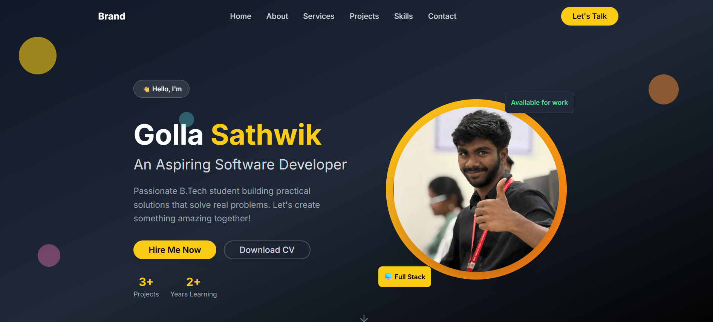
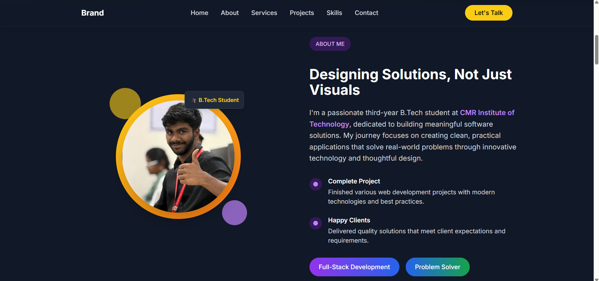
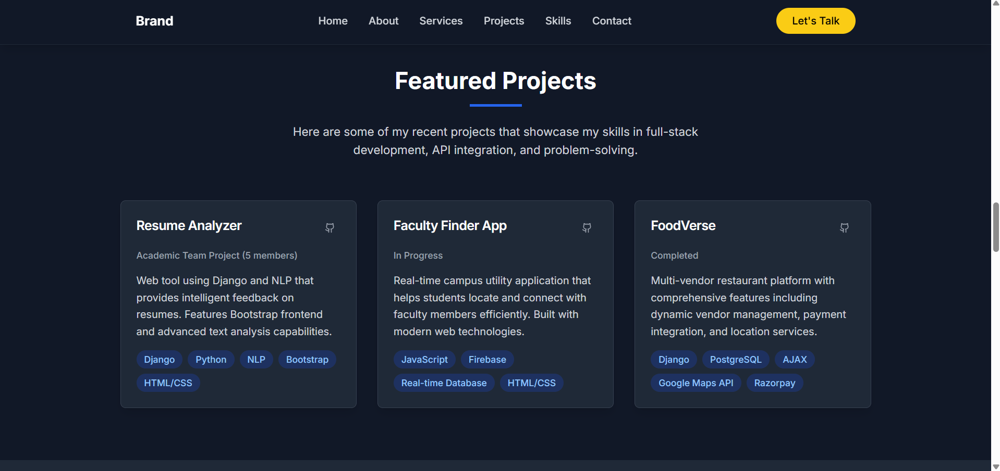
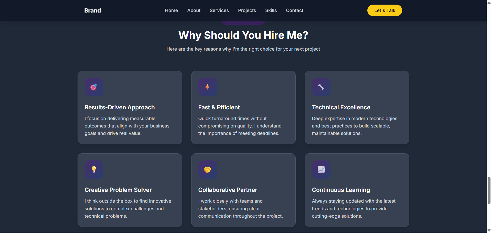

# 💼 Golla Sathwik's Portfolio Website

Welcome to my personal portfolio website!  
This project showcases who I am, the skills I possess, the projects I’ve worked on, and how to get in touch with me.

## 🌐 Live Demo

Check out the live version here: [Your Live Site Link](https://your-portfolio-link.com)

## 📂 Features

- Clean and modern UI built with **React + TypeScript**
- Fully responsive using **Tailwind CSS**
- Smooth animations and transitions
- Sections:
  - Hero / About Me
  - Skills & Tech Stack
  - Projects Showcase
  - Resume Download!

  - Contact Me / Social Links

## 🛠️ Tech Stack

| Technology      | Description                          |
|-----------------|--------------------------------------|
| **React**       | JavaScript library for UI            |
| **TypeScript**  | Strong typing for scalable code      |
| **Tailwind CSS**| Utility-first CSS framework          |
| **HTML5**       | Markup language                      |
| **CSS3**        | Styling language for HTML            |

## 🚀 Getting Started

Clone the repo and install dependencies:

```bash
git clone https://github.com/your-username/your-portfolio-repo.git
cd your-portfolio-repo
npm install
npm run dev

## 🖼️ Screenshots

### 🔹 Homepage


### 🔹 About Me Section


### 🔹 Projects Section


### 🔹 Contact Section

